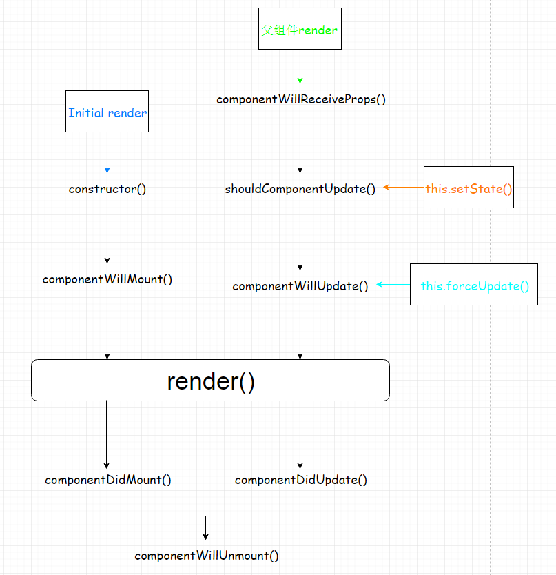

## 生命周期函数

当通过调用 React.createClass() 来创建组件的时候，你应该提供一个包含 render 方法的对象，并且也可以包含其它的在这里描述的生命周期方法。

### 首次加载时触发的生命周期

```
class App extends React.Component{
	constructor(){
		super()
			console.log('constructor')
	}
	componentWillMount(){
		console.log('will Mount')
	}
	componentDidMount(){
		console.log('did Mount')
	}
	render(){
		console.log('render')
		return(
			<div>
				App
			</div>
		)
	}
}
export default App
```

**constructor**（自带的默认方法传递`state`和`props`）

 - 构造函数，只有初始化时调用载一次

**comonentWillMount** 挂载前

 - 在组件挂载之前调用一次。如果在这个函数里面调用`setState`，本次的`render`函数可以看到更新后的`state`，并且只渲染一次。

**render** 挂载（必须）

 - 返回值必须是一个React的`element`（JSX节点），不能在`render`内修改`state`

**comonentDidMount** 挂载完成后

 - 在组件挂载之后调用一次。这个时候，子主键也都挂载好了，可以在这里使用`refs`。

### 更新阶段（重新渲染）

`state`被`setState`修改或props被修改会触发更新

```
import React from 'react'

class App extends React.Component{
	constructor(){
		console.log('constructor')
		super()
		this.state = ({
			num:0
		})  
	}
	componentWillMount(){
		console.log('will Mount')
	}
	componentDidMount(){
		console.log('did Mount')
	}
	shouldComponentUpdate(nextProps,nextState){
		console.log('should Update',nextProps,nextState)
		return true
	}
	componentWillUpdate(){
		console.log('will Update')
	}
	componentDidUpdate(){
		console.log('did Update')
	}
	render(){
		console.log('render')
		return(
			<div>
				<p>{this.state.num}</p>
				<button onClick={() => this.setState({num:++this.state.num})}>+1</button>
			</div>
		)
	}
}
export default App
```

**shouldComponentUpdate** （判断是否需要重新渲染组件）

 - 必须有返回值（返回值为一个bool值）如果返回`true`重新`render`（渲染）。
 - `shouleComponentUpdata(nextProps,nextState)`的两个参数（形参）

**componentWillUpdate** （重新渲染前）

 - `shouldComponentUpdate`返回`true`或者调用`forceUpdate`之后，`componentWillUpdate`会被调用。
 - 除了首次`render`之后调用`componentWillMount`，其它`render`结束之后都是调用`componentWillUpdate`。
 
**render**（渲染）
 
**componentDidUpdate**（渲染完成后）

 - 除了首次`render`之后调用`componentDidMount`，其它`render`结束之后都是调用`componentDidUpdate`。

### 子组件的生命周期流程

子组件

```
import React from 'react'

class Test extends React.Component{
	constructor(){
		super()
		console.log('test constructor')
	}
	componentWillMount(){
		console.log('test will Mount')
	}
	componentDidMount(){
		console.log('test did Mount')
	}
	shouldComponentUpdate(nextProps,nextState){
		console.log('test should')
		return true
	}
	componentWillUpdate(){
		console.log('test Update')
	}
	componentDidUpdate(){
		console.log('test did Update')
	}
	render(){
		console.log('text render')
		return (
			<div className='Test'>  
				<span>{this.props.num}</span>
			</div>
		)
	}
}
export default Test
```

父组件
```
import React from 'react'
import Test from './Test'

class App extends React.Component{
	constructor(){
		console.log('constructor')
		super()
		this.state = ({
			num:0
		})  
	}
	componentWillMount(){
		console.log('will Mount')
	}
	componentDidMount(){
		console.log('did Mount')
	}
	componentWillReceiveProps(nextProps){
		console.log('ReceiveProps',nextProps)
	}
	shouldComponentUpdate(nextProps,nextState){
		console.log('should',nextProps,nextState.num)
		if(nextState.num>10){
			alert('超过上限')
			this.btn.disabled = true
		}else{
			return true
		}
	}
	componentWillUpdate(){
		console.log('Update')
	}
	componentDidUpdate(){
		console.log('did Update')
	}
	render(){
		console.log('render')
		return(
			<div>
				<Test num={this.state.num} />
				<input type='button' value='+1' ref={btn => this.btn = btn} onClick={() => this.setState({num:++this.state.num})} />
			</div>
		)
	}
}
export default App
```

**componentWillReceiveProps**（props改变时触发）

 - `props`是父组件传递给子组件的。父组件发生`render`的时候子组件就会调用`componentWillReceiveProps`（不管`props`有没有更新，也不管父子组件之间有没有数据交换）。

### 销毁组件

子组件（要销毁的组件）
```
import React from 'react'

class Test extends React.Component{
	constructor(){
		super()
		console.log('test constructor')
	}
	componentWillMount(){
		console.log('test will Mount')
	}
	componentDidMount(){
		console.log('test did Mount')
	}
	shouldComponentUpdate(nextProps,nextState){
		console.log('test should')
		return true
	}
	componentWillUpdate(){
		console.log('test Update')
	}
	componentDidUpdate(){
		console.log('test did Update')
	}
	componentWillUnmount(){
		console.log('test Un')
	}
	render(){
		console.log('text render')
		return (
			<div className='Test'>  
					<span>{this.props.num}</span>
			</div>
		)
	}
}
export default Test
```

父组件

```
import React from 'react'
import Test from './Test'

class App extends React.Component{
	constructor(){
		console.log('constructor')
		super()
		this.state = ({
			num:0,
			show:true
		})  
	}
	componentWillMount(){
		console.log('will Mount')
	}
	componentDidMount(){
		console.log('did Mount')
	}
	componentWillReceiveProps(nextProps){
		console.log('ReceiveProps',nextProps)
	}
	shouldComponentUpdate(nextProps,nextState){
		console.log('should',nextProps,nextState.num)
		if(nextState.num>10){
			alert('超过上限')
			this.btn.disabled = true
		}else{
			return true
		}
	}
	componentWillUpdate(){
		console.log('Update')
	}
	componentDidUpdate(){
		console.log('did Update')
	}
	render(){
			console.log('render')
			return(
				<div>
					{ this.state.show ? <Test num={this.state.num} /> : null }
					<input type='button' value='+1' ref={btn => this.btn = btn} onClick={() => this.setState({num:++this.state.num})} />
					<input type='button' value='销毁' onClick={() => this.setState({show:false})} />
				</div>
		)
	}
}
export default App
```

**componentWillUnmount** （销毁组件）

 - 组件被卸载的时候调用。一般在`componentDidMount`里面注册的事件需要在这里删除。很少应用

### 生命周期函数进程



