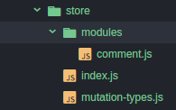

# Vuex

Vuex 是一个专为 Vue.js 应用程序开发的状态管理模式，类似 React 中的 Redux

### 装包

```
npm install vuex --save
```

### 注入 store

导入 store

```js
import store from './store'
```

将 store 注入到组件中

```js
new Vue({
  el: '#app',
  router,
  store,
  template: '<App/>',
  components: { App }
})
```
### 创建 store

我们这里根据官网给出的例子，创建 store

数据结构为：


其中`index.js` 在 store 中创建 store 并将数据组合的作用，类似 Redux 中的 combineReducers

```js
import Vue from 'vue'
import Vuex from 'vuex'
//引用 vuex
import comment from './modules/comment'
// 导入 comment 数据
Vue.use(Vuex)
// 安装使用 vuex 插件
export default new Vuex.Store({
  // 创建 store 并导出
  modules: {
    comment
  }
})
```

Vuex 通过 Vue.use(Vuex) 提供了一种机制将状态从根组件『注入』到每一个子组件中 store 选项，在组件需要 store 时，用 （`this.$store.state`）调用

```js
const state = {
  all: [
    { text: 'haha' },
    { text: 'gege' }
  ]
}

export default {
  state
}
```

在 modules 文件夹中写入数据并导出

### 读取数据

Vuex 的状态存储是响应式的，从 store 实例中读取状态最简单的方法就是在计算属性中返回某个状态：

```js
<script>
export default {
  name: 'comment-box',
  computed: {
  // 计算属性 computed 中  
    comments: function () {
    //comments 方法
      return this.$store.state.comment.all
      //返回 store 中的数据
    }
  }
}
</script>
```

通过 Mustache 进行渲染

```html
<template>
  <li v-for="comment in reversedMessage">
    {{ comment.text }}
  </li>
</template>
```

### 参考

 - Vuex文档：[点击进入](https://vuex.vuejs.org/zh-cn/)

 - Vuex官网例子：[点击进入](https://github.com/vuejs/vuex/tree/dev/examples)
