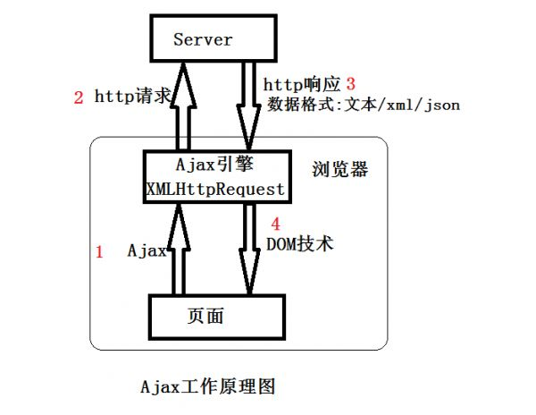

## AJAX

### 简介

 - AJAX = Asynchronous JavaScript and XML（异步的 JavaScript 和 XML）。
 - AJAX 不是新的编程语言，而是一种使用现有标准的新方法。
 - AJAX 是与服务器交换数据并更新部分网页的艺术，在不重新加载整个页面的情况下。

### AJAX工作原理



### `XMLHttpRequest`对象

`XMLHttpRequest`用于在后台与服务器交换数据。这意味着可以在不重新加载整个网页的情况下，对网页的某部分进行更新。

**创建`XMLHttpRequest`对象的语法**

```
var xml = new XMLHttpRequest()
```

### 请求

**向服务器发送请求**

```
xml.open('method','url',async);
```
 - method：请求的类型；GET 或 POST
 - url：文件在服务器上的位置
 - async：true（异步）或 false（同步）

**将请求发送到服务器**

```
xml.send(string)
```

string：仅用于 POST 请求

**例**：发送一个`GET`请求

```
var xml = new XMLHttpRequest()
xml.open('GET','https://api.github.com/users/l552177239',true)
xml.send()
```

**向一个POST请求添加请求头**

如果需要像 HTML 表单那样 POST 数据，请使用`setRequestHeader()`来添加 HTTP 头。然后在`send()`方法中规定您希望发送的数据。

```
setRequestHeader(header,value)
```
 - header: 规定头的名称
 - value: 规定头的值

**例**：通过`access token`，发送一个登陆的`POST`请求,

```
xml.open('POST','https://cnodejs.org/api/v1/accesstoken',true);
xml.setRequestHeader("Content-type","application/json");
let date = {
		accesstoken:'3f77acb1-d753-4393-b784-44913190e6a8'
}
xml.send(JSON.stringify(date))
```

### 响应

**服务器响应**

如需获得来自服务器的响应，请使用`XMLHttpRequest`对象的`responseText`或`responseXML`属性。

属性 			| 描述 
--------------- | ------------------------------------------
responseText	| 获得字符串形式的响应数据。
responseXML		| 获得 XML 形式的响应数据。

将服务器返回的数据转换为字符串

```
var text = JSON.parse(xml.responseText)
```

### `onreadystatechange`事件

XMLHttpRequest 对象的三个重要的属性

属性 				 | 描述 
-------------------- | --------------------------------------------------------
onreadystatechange	 | 存储函数（或函数名），每当readyState属性改变时，就会调用该函数。
readyState			 | 存有 XMLHttpRequest 的状态。从 0 到 4 发生变化。<br> - 0: 请求未初始化<br> - 1: 服务器连接已建立<br> - 2: 请求已接收<br> - 3: 请求处理中<br> - 4: 请求已完成，且响应已就绪
status 				 |200: "OK"<br>404: 未找到页面

**onreadystatechange**

在`onreadystatechange`事件中，我们规定当服务器响应已做好被处理的准备时所执行的任务。
当`readyState`等于 4 且状态为 200 时，表示响应已就绪：

```
xml.onreadystatechange=function()
	{
	if (xml.readyState==4 && xml.status==200)
		{
			document.getElementById("myDiv").innerHTML=xml.responseText;
		}
	}
```

**例**：在 HTML 内渲染帐号的`id`和服务器返回的 JSON 数据

```html
<!DOCTYPE html>
<html>
<head>
		<title></title>
</head>
<body>
		<div id="q">   
		</div>
		<p id='l'></p>
		<script>
				var xml = new XMLHttpRequest();
				xml.onreadystatechange=function(){
						if (xml.readyState===4 && xml.status===200){
								console.log('json',xml.responseText)
								let date = JSON.parse(xml.responseText)
								q.innerText =date.id
								document.getElementById("l").innerText=xml.responseText;
						}
				}
				xml.open('POST','https://cnodejs.org/api/v1/accesstoken',true);
				xml.setRequestHeader("Content-type","application/json");
				let date = {
						accesstoken:'3f77acb1-d753-4393-b784-44913190e6a8'
				}
				xml.send(JSON.stringify(date))
		</script>
</body>
</html>
```

### 利用组件发AJAX请求

**JQ的`ajax`方法**

```
<script src="https://cdn.bootcss.com/jquery/3.2.1/jquery.min.js"></script>
<script>
	$.ajax({
		url:'https://api.github.com/users/l552177239',
		success:function(data,state,XHR){
			console.log(data,state,XHR)
		},
		error:function(data,state,XHR){
			console.log(data,state,XHR)
		}
	})
</script>
```

**例**：搜索账号

```
<body>
	<div class="wrap">
			<input type="text" id='username' placeholder="请输入帐号" />
			<input type="button" id='search' value="搜索" />
			<p id='playground'></p>
	</div>
	<script src="https://cdn.bootcss.com/jquery/3.2.1/jquery.min.js"></script>
	<script>
		$('#search').click(function(){
			var username = $('#username').val()	
			$.ajax({
				url:'https://api.github.com/users/'+username,
				success:function(data,state,XHR){
					//console.log(data,state,XHR)
					var str = ''
					 str += `<h3>用户名：${data.login}</h3><p>最近更新时间：${data.updated_at}</p>`
					$('#playground').html(str)
				},
				error:function(data,state,XHR){
					alert('很抱歉，搜索失败,错误为：'+error)
				}
			})
		})
	</script>
</body>
```

 - W3C的`ajax`方法：[点击跳转](http://www.w3school.com.cn/jquery/ajax_ajax.asp)
 - JQ官网的方法：[点击跳转](http://api.jquery.com/category/ajax/global-ajax-event-handlers/)
 - JQ中文文档地址：[点击跳转](http://www.css88.com/jqapi-1.9/category/ajax/global-ajax-event-handlers/)

**ES6的`Promise`方法**

```
<script>
	var test = new Promise( function(resolve, reject){
		console.log('执行中')
		setTimeout(function(){
			console.log('完成')
			resolve()
		},5000)
	}).then(function(){
		console.log('真慢')
	}).catch(function(){
		console.log('完不成了')
	})
</script>
```

 - MDN参考地址：[点击跳转](https://developer.mozilla.org/zh-CN/docs/Web/JavaScript/Reference/Global_Objects/Promise)
 - ES6入门：[点击跳转](http://es6.ruanyifeng.com/#docs/promise)

**Window新增的`fetch`方法**

```
<script>
	fetch('https://api.github.com/users/l552177239')
		.then(function(data){
			return data.json()
		}).then(function(json){
			console.log(json)
		}).catch(function(err){
			console.log(err)
	})
</script>
```

 - MDN参考地址：[点击跳转](https://developer.mozilla.org/zh-CN/docs/Web/API/Fetch_API/Using_Fetch)

**axios库**

```
<script src="https://unpkg.com/axios/dist/axios.min.js"></script>
<script>
	axios.get('https://api.github.com/users/l552177239')
	.then(function (response) {
		console.log(response.data);
	})
	.catch(function (error) {
		console.log(error);
	})
</script>
```

 - Github参考地址：[点击跳转](https://github.com/mzabriskie/axios)
 - 中文文档地址：[点击跳转](https://www.kancloud.cn/yunye/axios/234845)